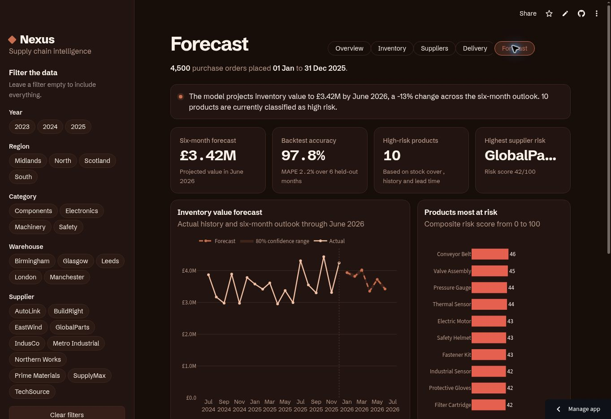

# Nexus Supply Chain Analytics

> **Supply-chain analytics case study combining Excel, Python, forecasting, risk scoring, Plotly, and Streamlit to support inventory, supplier, and delivery decisions.**

**Live dashboard:** https://srlfk2tvpyacbyrvfdyoss.streamlit.app/

## Executive Summary

Nexus Supply Chain Analytics turns purchasing, inventory, supplier, and delivery records into an interactive decision-support application.

The project starts with **Excel for inspection, cleaning, PivotTables, and KPI validation**, then extends the workflow with **Python and pandas** for transformation, forecasting, risk scoring, and interactive reporting.

The dashboard analyses **4,500 synthetic purchase orders from 2023–2025** and forecasts inventory value for **January–June 2026**.

## Business Problem

Supply-chain teams often manage inventory and supplier information across disconnected spreadsheets. This makes it difficult to identify stock exposure, compare supplier reliability, understand delivery delays, and plan future inventory requirements.

The project helps an operations manager answer:

- How much capital is held in inventory?
- Which products and warehouses have the greatest stock risk?
- Which suppliers perform reliably?
- Where are delivery delays occurring?
- What inventory value should the business expect over the next six months?

## Analytics Workflow

**Excel Inspection → Data Cleaning → Python Transformation → KPI Analysis → Forecasting & Risk Scoring → Streamlit Dashboard**

## Technology Stack

| Layer | Technology | Purpose |
|---|---|---|
| Initial analysis | Excel | Inspection, cleaning, PivotTables, KPI validation |
| Data preparation | Python, pandas, NumPy | Transformation and feature engineering |
| Analysis | pandas, NumPy | KPIs, aggregation and risk scoring |
| Forecasting | NumPy least squares | Trend/seasonality forecast |
| Visualization | Plotly | Interactive charts |
| Application | Streamlit | Dashboard and filters |
| Deployment | Streamlit Community Cloud | Public hosting |
| Version control | Git/GitHub | Source control and documentation |

## Dashboard Features

- Overview, Inventory, Suppliers, Delivery, and Forecast pages
- Filters for year, region, category, warehouse, and supplier
- Inventory-value and units-in-stock trends
- Inventory status and stock-risk analysis
- Supplier reliability scorecard
- Delivery and late-order analysis
- Six-month forecast with an 80% confidence range
- Holdout backtesting with MAE and MAPE
- Product stock-risk scores
- Supplier delay-risk scores
- Downloadable tables

## Dataset

Synthetic procurement and inventory data created for portfolio demonstration.

| Dimension | Value |
|---|---:|
| Purchase orders | 4,500 |
| Historical period | Jan 2023 – Dec 2025 |
| Forecast horizon | Jan – Jun 2026 |
| Columns | 30 |
| Suppliers | 10 |
| Warehouses | 5 |
| Regions | 4 |
| Categories | 4 |

Key fields include order date, product, supplier, warehouse, region, units ordered/received, unit cost, inventory on hand, reorder point, expected/actual delivery, shipping cost, defects, lead time, delivery status, and inventory status.

## Data Preparation

### Excel

Excel was used to inspect and validate the raw data:

- Correct date, text, integer, decimal, and percentage types
- Create inventory value, stockout, on-time, and month fields
- Build PivotTables for inventory, delivery, stockout, and lead-time KPIs
- Validate headline metrics
- Compare ordered units, received units, and inventory on hand

### Python

Python/pandas then:

1. Validated order and delivery dates.
2. Standardized categorical labels.
3. Validated numeric fields.
4. Derived year and month fields.
5. Calculated inventory value.
6. Calculated defect rate, delay days, lead time, and on-time flags.
7. Classified inventory as Healthy, Low Stock, Out of Stock, or Overstock.
8. Created continuous monthly fields for time-series analysis.
9. Checked that received units did not exceed ordered units.
10. Prepared the analytical CSV used by the application.

## Forecasting & Risk Analysis

The predictive layer contains:

### Inventory Forecast
A transparent trend-and-seasonality model using NumPy least squares forecasts inventory value through June 2026.

### Backtesting
Six historical months are held out to evaluate the forecast using MAE and MAPE.

### Product Risk
Products receive risk scores based on operational indicators including low-stock frequency, inventory volatility, lead time, and defect rate.

### Supplier Risk
Suppliers are scored using late-delivery frequency, lead time, and defect performance.

## Key Findings

- Total inventory value is approximately **£115.18M** across the synthetic dataset.
- Overall on-time delivery is approximately **79.7%**.
- June 2026 forecast inventory value is approximately **£3.42M**.
- Six-month holdout backtesting produces approximately **2.2% MAPE**, equivalent to about **97.8% accuracy**.
- **10 products** are classified as high risk under the current unfiltered view.
- **GlobalParts** has the highest supplier delay-risk score in the current unfiltered view.

> Dashboard figures can change when filters are applied.

## SQL Extension

The current hosted application reads the prepared CSV with pandas. SQL is documented as the database-layer extension for the same business questions, including monthly inventory trends, supplier reliability, and stock-risk analysis.

Example:

```sql
SELECT
    supplier_name,
    COUNT(*) AS total_orders,
    AVG(on_time_flag) AS on_time_rate,
    AVG(defect_rate) AS average_defect_rate,
    AVG(lead_time_days) AS average_lead_time
FROM supply_chain_orders
GROUP BY supplier_name
ORDER BY on_time_rate DESC, average_defect_rate ASC;
```

## Screenshots



The live application contains additional Overview, Inventory, Suppliers, and Delivery pages.

## Run Locally

```bash
git clone https://github.com/austinechi1/Nexus-Supply-Chain-Analytics.git
cd Nexus-Supply-Chain-Analytics
python -m venv .venv
```

Windows:

```powershell
.venv\Scripts\activate
python -m pip install -r requirements.txt
streamlit run app.py
```

## Future Improvements

- PostgreSQL-backed data layer
- Scheduled ingestion and transformation
- Forecast-model comparison
- Product/warehouse unit forecasting
- Automated reorder recommendations
- Anomaly detection
- Natural-language analytics with cited results
- Automated tests and CI

## Author

**Nwachukwu Austine**  
Data Analyst | SQL | Python | Power BI

[GitHub](https://github.com/austinechi1) · [Portfolio](https://austinechi1.github.io/)
