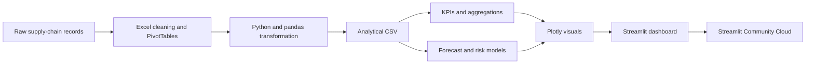

# Nexus Supply Chain Analytics

An interactive supply-chain analytics and forecasting project built with Excel, Python, pandas, Plotly and Streamlit.

**Live dashboard:** https://srlfk2tvpyacbyrvfdyoss.streamlit.app/

## Project Overview

Nexus Supply Chain Analytics is a portfolio project that turns purchasing, inventory, supplier and delivery records into an interactive decision-support application. Excel was used for the initial inspection, cleaning, PivotTable analysis and KPI validation. Python then extended the work into interactive analysis and forecasting. The dashboard combines descriptive, diagnostic and predictive analysis across 4,500 synthetic purchase orders from 2023 to 2025, with a six-month inventory-value forecast for January through June 2026.

## Business Problem

Supply-chain teams often manage inventory, supplier and delivery information across disconnected spreadsheets. This makes it difficult to identify stock exposure, compare supplier reliability, monitor delivery performance and plan future inventory requirements.

The project helps an operations manager answer:

- How much capital is currently held in inventory?
- Which products and warehouses have the greatest stock risk?
- Which suppliers deliver reliably and with fewer defects?
- Where are delivery delays occurring?
- What inventory value should the business expect during the next six months?

## Project Objectives

- Consolidate three years of supply-chain records into one analytical dataset.
- Track inventory value, stockouts, lead times, defects and on-time delivery.
- Compare products, categories, regions, warehouses and suppliers.
- Provide filters for investigating operational segments.
- Forecast inventory value for the first six months of 2026.
- Rank products by future stock-risk exposure.
- Present the findings through a public interactive web application.

## Features

- Five analytical pages: **Overview, Inventory, Suppliers, Delivery and Forecast**.
- Interactive filters for year, region, category, warehouse and supplier.
- KPI cards with month-over-month context.
- Monthly inventory value and units-in-stock trends.
- Inventory-status, regional, category and warehouse analysis.
- Supplier reliability matrix and scorecard.
- Monthly and warehouse-level delivery analysis.
- Detailed restocking and late-order tables.
- Six-month inventory-value forecast with an 80% confidence range.
- Holdout backtesting with MAE and MAPE reporting.
- Product stock-risk and supplier delay-risk scores.
- Downloadable tables inside the Streamlit application.

## Technology Stack

| Layer | Technology | Purpose |
|---|---|---|
| Initial analysis | Microsoft Excel | Data inspection, cleaning, calculated columns, PivotTables and KPI validation |
| Data preparation | Python, pandas, NumPy | Cleaning, transformation and feature engineering |
| Analysis | pandas, NumPy | Aggregation, KPI calculation and predictive scoring |
| Visualisation | Plotly | Interactive charts and hover details |
| Application | Streamlit | Filters, navigation, KPI cards and data tables |
| Version control | Git, GitHub | Source-code management and documentation |
| Deployment | Streamlit Community Cloud | Public hosting and automatic deployment |

## Architecture



## Dataset

The project uses a synthetic procurement and inventory dataset created for portfolio demonstration.

- **Rows:** 4,500 purchase orders
- **Period:** January 2023 to December 2025
- **Forecast horizon:** January to June 2026
- **Columns:** 30
- **Suppliers:** 10
- **Warehouses:** 5
- **Regions:** 4
- **Product categories:** Components, Electronics, Machinery and Safety

Important fields include order date, product, supplier, warehouse, region, units ordered, units received, unit cost, inventory on hand, reorder point, expected delivery, actual delivery, shipping cost, defects, lead time, delivery status and inventory status.

## Data Cleaning

### Excel preparation

Excel was used to understand the raw file before the application was developed. The workbook workflow included:

- Reviewing the raw-data and data-dictionary sheets.
- Correcting date, text, whole-number, decimal and percentage data types.
- Creating calculated fields for inventory value, stockout status, on-time delivery and month labels.
- Building PivotTables for inventory value, monthly trends, stockout rate, on-time delivery and lead time.
- Checking month sorting and validating the headline KPIs.
- Comparing units ordered, units received and inventory on hand.

### Python preparation

1. Converted order and delivery fields to valid date types.
2. Standardised categorical labels for regions, warehouses, suppliers and statuses.
3. Validated numeric columns and handled invalid or missing values.
4. Derived year, month number and abbreviated month name.
5. Calculated inventory value from units on hand and unit cost.
6. Calculated defect rate, delay days, lead time and on-time flags.
7. Classified records as Healthy, Low Stock, Out of Stock or Overstock.
8. Created a continuous monthly date field for time-series analysis.
9. Checked that received units did not exceed ordered units.
10. Expanded the synthetic history consistently across 2023–2025.

## SQL Analysis

The deployed application performs its calculations in Python. The same business questions can be reproduced in SQL before loading an analytical table into Streamlit.

```sql
-- Monthly inventory value
SELECT
    DATE_TRUNC('month', order_date) AS month,
    SUM(inventory_value) AS inventory_value
FROM supply_chain_orders
GROUP BY 1
ORDER BY 1;

-- Supplier reliability
SELECT
    supplier_name,
    COUNT(*) AS total_orders,
    AVG(on_time_flag) AS on_time_rate,
    AVG(defect_rate) AS average_defect_rate,
    AVG(lead_time_days) AS average_lead_time
FROM supply_chain_orders
GROUP BY supplier_name
ORDER BY on_time_rate DESC, average_defect_rate ASC;

-- Products requiring attention
SELECT
    product_name,
    warehouse,
    AVG(inventory_on_hand) AS average_on_hand,
    AVG(reorder_point) AS average_reorder_point
FROM supply_chain_orders
WHERE inventory_status IN ('Low Stock', 'Out of Stock')
GROUP BY product_name, warehouse
ORDER BY average_on_hand;
```

SQL is presented as the database-layer extension of the project. The current hosted version reads the prepared CSV directly with pandas.

## Python Analysis

- Loads and validates the prepared CSV with pandas.
- Applies filters across years and operational dimensions.
- Aggregates monthly, regional, warehouse, category, product and supplier metrics.
- Calculates inventory value, stockout rate, on-time rate, defect rate and lead time.
- Produces dynamic month-over-month KPI commentary.
- Builds a trend-and-seasonality inventory forecast using NumPy least squares.
- Backtests the model against six held-out months.
- Calculates product and supplier risk scores from operational indicators.
- Sends results to Plotly and Streamlit for interactive exploration.

## Excel Analysis

The Excel stage provided the first analytical view of the data and helped validate the later Python dashboard. The workbook analysis included:

- Total inventory value.
- Average stockout rate.
- On-time delivery rate.
- Average lead time in days.
- Monthly inventory-value and units-in-stock trends.
- Inventory analysis by product, supplier, warehouse, region and category.
- PivotTable comparisons of ordered units, received units and available inventory.

This staged workflow demonstrates how an analyst can begin with familiar spreadsheet tools, validate business logic, and then move the same analysis into a scalable Python application.

## AI Integration

The project currently uses predictive analytics rather than a generative-AI service. No external AI API or large language model is required to run the dashboard.

The predictive layer includes:

- A transparent trend-and-seasonality forecasting model.
- Product stock-risk scoring based on historical low-stock frequency, inventory volatility, lead time and defect rate.
- Supplier delay-risk scoring based on late-delivery frequency, lead time and defects.

A future AI extension could allow users to ask questions in natural language, receive chart explanations and generate recommended operational actions. Any such feature should clearly cite the filtered data used to produce its answer.

## Screenshots

### Predictive Forecast Page


The live application contains additional Overview, Inventory, Suppliers and Delivery pages.

## Example Questions

- How has inventory value changed from 2023 to 2025?
- Which region holds the highest share of inventory value?
- Which warehouse has the weakest on-time delivery performance?
- Which products require immediate restocking?
- Which suppliers combine strong delivery performance with low defect rates?
- What is the expected inventory value for June 2026?
- Which products have the highest predicted stock-risk scores?
- How does selecting one supplier or warehouse change the forecast?

## Example Insights

- Total inventory value across the three-year synthetic dataset is approximately **£115.18 million**.
- Overall on-time delivery is approximately **79.7%**, improving across the three-year period.
- The model forecasts inventory value of approximately **£3.42 million for June 2026**.
- The six-month holdout backtest produces approximately **97.8% accuracy**, equivalent to about **2.2% MAPE**.
- **10 products** are classified as high risk under the current unfiltered view.
- **GlobalParts** has the highest supplier delay-risk score in the current unfiltered view.

Dashboard values respond to filters, so individual figures may change when a user selects a year, region, category, warehouse or supplier.

## How to Run Locally

1. Clone the repository:

```bash
git clone https://github.com/austinechi1/Nexus-Supply-Chain-Analytics.git
cd Nexus-Supply-Chain-Analytics
```

2. Create and activate a virtual environment:

```bash
python -m venv .venv
```

Windows:

```bash
.venv\Scripts\activate
```

macOS or Linux:

```bash
source .venv/bin/activate
```

3. Install the required packages:

```bash
pip install -r requirements.txt
```

4. Start the application:

```bash
streamlit run app.py
```

5. Open the local URL shown in the terminal, normally `http://localhost:8501`.

## Future Improvements

- Connect the application to PostgreSQL instead of a local CSV.
- Add scheduled ingestion and transformation pipelines.
- Compare multiple forecasting models and track their performance.
- Forecast units required at product and warehouse level.
- Add automated reorder-quantity recommendations.
- Add anomaly detection for unusual costs, defects and lead times.
- Add natural-language analytics with cited, filter-aware answers.
- Add role-based access and operational alert notifications.
- Add automated tests and a continuous-integration workflow.

## Author

**Nwachukwu Austine**  
Data and Business Analyst  
GitHub: [@austinechi1](https://github.com/austinechi1)
